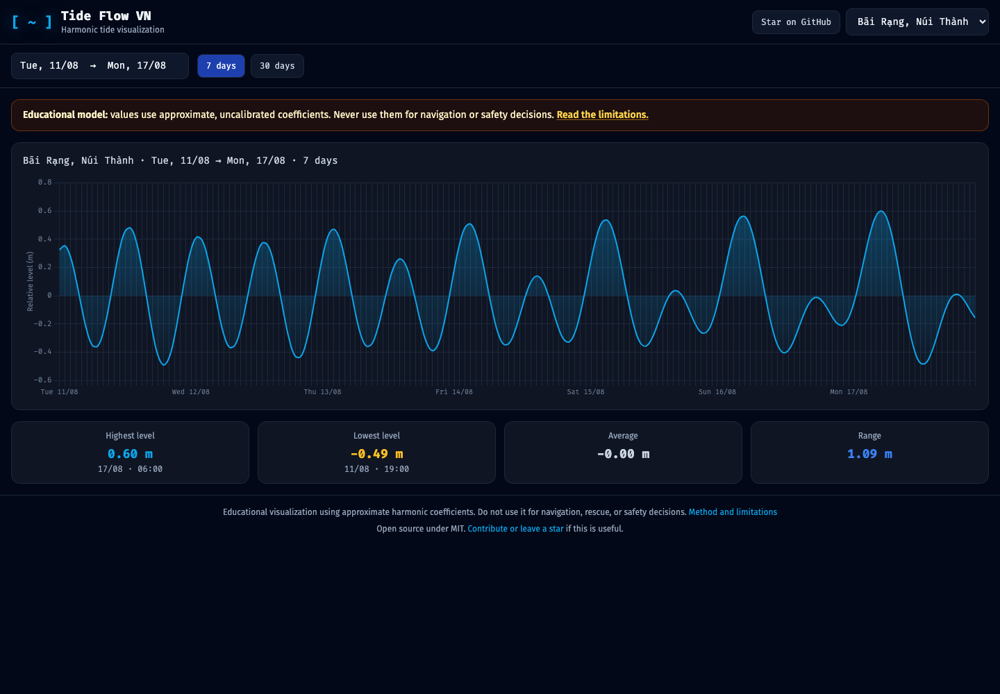

# Tide Flow VN

[](https://github.com/vinhnguyenthanhdn/tide-flow/actions/workflows/ci.yml)
[](LICENSE)
[](https://vinhnguyenthanhdn.github.io/tide-flow/)

An open-source, browser-based visualization of approximate tidal patterns at 12 coastal locations in Vietnam. Tide Flow VN runs without a backend or tide API: a small harmonic model generates hourly values, and Chart.js makes the pattern explorable.

**[Open the live demo](https://vinhnguyenthanhdn.github.io/tide-flow/)** · **[Report a problem](https://github.com/vinhnguyenthanhdn/tide-flow/issues/new/choose)**



> [!IMPORTANT]
> Tide Flow VN is an educational visualization, not an official tide table. The coefficients are approximate and have not been calibrated against a named gauge and datum. Do not use it for navigation, fishing safety, rescue, flood warnings, or any decision where timing or water level matters.

## Why this project exists

Vietnamese tide information is often published as static tables or images. This project explores a smaller, inspectable alternative: represent a location as a handful of harmonic constituents, generate the curve locally, and make the assumptions visible in code.

The repository is intentionally lightweight so that contributors can understand the full path from coefficients to pixels without learning a framework or provisioning a backend.

## Features

- 12 coastal locations across Vietnam.
- Seven-day, 30-day, and custom date ranges.
- Hourly harmonic curve with high, low, average, and range statistics.
- Zoom, pan, a horizontally explorable mobile chart, and an English UI.
- No account, analytics, backend, or runtime tide API.
- Unit tests for the model and date handling; Playwright tests for the UI.

## Quick start

Requirements: Node.js 20.19 or newer.

```bash
git clone https://github.com/vinhnguyenthanhdn/tide-flow.git
cd tide-flow
npm ci
npm run build
npm run serve
```

Open <http://localhost:3000>. The application itself is static; Node is only used for the local server and test tooling.

Run the checks:

```bash
npm test                 # unit tests
npx playwright install chromium
npm run test:e2e         # browser tests
npm run test:coverage    # coverage report
```

## How it works

For each location, the model adds a mean offset and five harmonic constituents:

```text
h(t) = Z0 + Σ Aᵢ cos(ωᵢt − φᵢ)
```

- `Aᵢ` is the constituent amplitude.
- `ωᵢ` is its known angular speed.
- `φᵢ` is the local phase offset.
- `t` is the number of hours since 2000-01-01 00:00 UTC.

The current set uses M2, S2, N2, K1, and O1. The browser computes one value per hour and never sends a location or date range to a server. See [Model and data notes](docs/MODEL.md) for the assumptions and the work required before these curves can be called predictions.

## Model and limitations

The honest boundary of the project is important:

- The coefficients are approximate demo values, not an authoritative dataset.
- No gauge station, vertical datum, calibration interval, uncertainty, nodal correction, or meteorological residual is currently attached to them.
- Wind, pressure, river discharge, storm surge, bathymetry, and local harbor effects are outside the model.
- Displayed maxima and minima are extrema of the generated hourly series, not certified high/low tide events.
- The date range is interpreted in Vietnam time (UTC+7).

A high-value contribution would replace one location's approximate coefficients with a reproducible, cited calibration and validation report. That work is more useful than adding many unsupported locations.

## Repository map

```text
.
├── index.html                 # static UI and external browser dependencies
├── app.js                     # Alpine component and Chart.js rendering
├── assets/tailwind.css        # generated, production-ready styles
├── src/
│   ├── locations.js          # supported locations and coordinates
│   ├── tide-constituents.js  # approximate coefficients
│   └── tide-math.js          # model and time-series helpers
├── tests/
│   ├── unit/                 # Vitest
│   └── e2e/                  # Playwright
└── docs/MODEL.md             # model assumptions and validation path
```

When changing classes in `index.html` or `app.js`, run `npm run build` and commit the regenerated stylesheet.

## Contributing

Contributions are welcome, especially:

- cited and reproducible gauge calibration;
- validation fixtures and uncertainty reporting;
- accessibility and mobile improvements;
- English copy improvements and accurate Vietnamese place names;
- tests that expose a real model or timezone error.

Read [CONTRIBUTING.md](CONTRIBUTING.md) before opening a pull request. For model changes, include the source, station/datum metadata, transformation steps, and an error comparison against held-out observations.

## Roadmap

- [ ] Calibrate the first location against a citable gauge dataset.
- [ ] Show source, datum, calibration period, and error per location.
- [ ] Add high/low event interpolation with uncertainty.
- [ ] Make the UI bilingual.
- [ ] Export a chart and its model metadata together.

## Support the project

If Tide Flow VN helped you learn, debug a visualization, or start a better calibrated implementation, **[leave a star](https://github.com/vinhnguyenthanhdn/tide-flow)**. Stars help other contributors discover the project.

The most valuable support is still evidence: open an issue with a public tide-gauge source, a reproducible mismatch, or a focused improvement you are willing to test.

## License

[MIT](LICENSE) © Vinh Nguyen.
